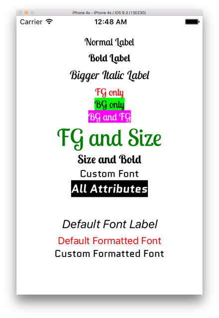

## xamarin-forms-formattedtext

Sample app for enabling cutom fonts on FormattedText on Labels.

Blog post: http://smstuebe.de/2016/04/03/formattedtext.xamrin.forms/



## โครงสร้างโปรเจค

- เพิ่มคลาส FormattedLabelRenderer ที่ Extend Xamarin.Forms.Platform.iOS.LabelRenderer
- เพิ่ม Font นามสกุล ttf

```
└── FormattedText
    ├── FormattedText
    │   ├── App.cs
    │   ├── MainPage.xaml
    │   ├── MainPage.xaml.cs
    │   └── Properties
    │       └── AssemblyInfo.cs
    └── FormattedText.iOS
        ├── AppDelegate.cs
        ├── FormattedLabelRenderer.cs
        ├── FormattedLabelRenderer.designer.cs
        ├── Main.cs
        ├── Properties
        │   └── AssemblyInfo.cs
        └── Resources
            ├── LobsterTwo-Bold.ttf
            ├── LobsterTwo-BoldItalic.ttf
            ├── LobsterTwo-Italic.ttf
            ├── LobsterTwo-Regular.ttf
            ├── Quantico-Bold.ttf
            ├── Quantico-BoldItalic.ttf
            ├── Quantico-Italic.ttf
            └── Quantico-Regular.ttf
```

## Api ที่เกี่ยวข้อง

- ExportRenderer ใช้สำหรับสร้าง Custom control library

## ไฟล์ FormattedLabelRenderer.cs

```csharp
[assembly: ExportRenderer(typeof(Label), typeof(FormattedLabelRenderer))]
namespace FormattedText.iOS {
    public class FormattedLabelRenderer : LabelRenderer {
        private static string GetFontName(string fontFamily, FontAttributes fontAttributes) {
            var postfix = "";
            var bold = fontAttributes.HasFlag(FontAttributes.Bold);
            var italic = fontAttributes.HasFlag(FontAttributes.Italic);
            if (bold && italic) { postfix = "-BoldItalic"; }
            else if (bold) { postfix = "-Bold"; }
            else if (italic) { postfix = "-Italic"; }

            return fontFamily + postfix;
        }

        protected override void OnElementChanged(ElementChangedEventArgs<Label> e) {
            base.OnElementChanged(e);
            UpdateFormattedText();
        }

        private void UpdateFormattedText() {
            var text = Control?.AttributedText as NSMutableAttributedString;
            if(text == null)
                return;

            var fontFamily = Element.FontFamily;
            text.BeginEditing();
            FixBackground(text);
            if (Element.FormattedText == null) {
                FixFontAtLocation(0, text, fontFamily, Element.FontAttributes);
            }
            else {
                var location = 0;
                foreach (var span in Element.FormattedText.Spans)
                {
                    var spanFamily = span.FontFamily ?? fontFamily;
                    FixFontAtLocation(location, text, spanFamily, span.FontAttributes);
                    location += span.Text.Length;
                }
            }
            text.EndEditing();
        }

        private void FixFontAtLocation(int location, NSMutableAttributedString text, string fontFamily, FontAttributes fontAttributes) {
            if(fontFamily == null)
                return;

            NSRange range;
            var font = (UIFont)text.GetAttribute(UIStringAttributeKey.Font, location, out range);
            var baseFontName = GetBaseFontName(fontFamily);

            if (font.Name.Contains("-") && font.Name.StartsWith(baseFontName))
                return;

            var newName = GetFontName(fontFamily, fontAttributes);
            font = UIFont.FromName(newName, font.PointSize);
            text.RemoveAttribute(UIStringAttributeKey.Font, range);
            text.AddAttribute(UIStringAttributeKey.Font, font, range);
        }

        private static void FixBackground(NSMutableAttributedString text) {
            var str = text.Value;
            for (var i = 0; i < str.Length; i++) {
                if (str[i] == '\n') {
                    text.RemoveAttribute(UIStringAttributeKey.BackgroundColor, new NSRange(i, 1));
                }
            }
        }

        private static string GetBaseFontName(string fontName) {
            var index = fontName.IndexOf('-');
            if (index >= 0) {
                fontName = fontName.Substring(0, index);
            }
            return fontName;
        }

        protected override void OnElementPropertyChanged(object sender, PropertyChangedEventArgs e) {
            base.OnElementPropertyChanged(sender, e);

            if (e.PropertyName == Label.FormattedTextProperty.PropertyName ||
                e.PropertyName == Label.TextProperty.PropertyName ||
                e.PropertyName == Label.FontAttributesProperty.PropertyName ||
                e.PropertyName == Label.FontProperty.PropertyName ||
                e.PropertyName == Label.FontSizeProperty.PropertyName ||
                e.PropertyName == Label.FontFamilyProperty.PropertyName ||
                e.PropertyName == Label.TextColorProperty.PropertyName)
            {
                UpdateFormattedText();
            }
        }
    }
}
```


